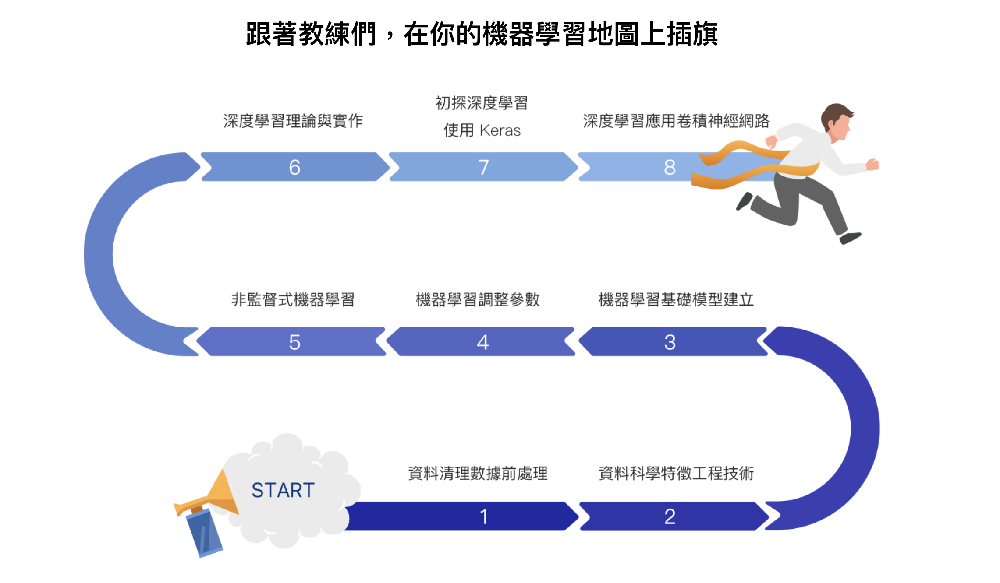

# 2nd-ML100Days

## Processing 資料清理前處理

## Feature Engineering 特徵工程

[[Day23]類別型特徵 - 均值編碼](https://github.com/yzmsp7/2nd-ML100Days/blob/master/homework/Day_023_HW.ipynb)
[[Day24]類別型特徵 - 其他進階處理理](https://github.com/yzmsp7/2nd-ML100Days/blob/master/homework/Day_024_HW.ipynb)
[[Day25]時間型特徵](https://github.com/yzmsp7/2nd-ML100Days/blob/master/homework/Day_025_HW.ipynb)
[[Day26]特徵組合 - 數值與數值組合](https://github.com/yzmsp7/2nd-ML100Days/blob/master/homework/Day_026_HW.ipynb)
[[Day27]特徵組合 - 類別與數值組合](https://github.com/yzmsp7/2nd-ML100Days/blob/master/homework/Day_027_HW.ipynb)
	- 重要知識點複習類別特徵與數值特徵，可以使⽤用群聚編碼組合出新的特徵
	- 群聚編碼最常使⽤用的運算是 mean, 除此之外還有median、mode、max、min、count等統計量量可以使⽤
	- 用群聚編碼與之前的均值編碼最主要的差異異，⼀一個是特徵彼此之間與特徵⽬目標值之間的差異異，另⼀一個最⼤大的差異異是 : 群聚編碼因為與⽬目標值無關，因此不容易易Overfitting，也因此比均值編碼使⽤用頻率⾼高得多

## Model Selection 模型選擇